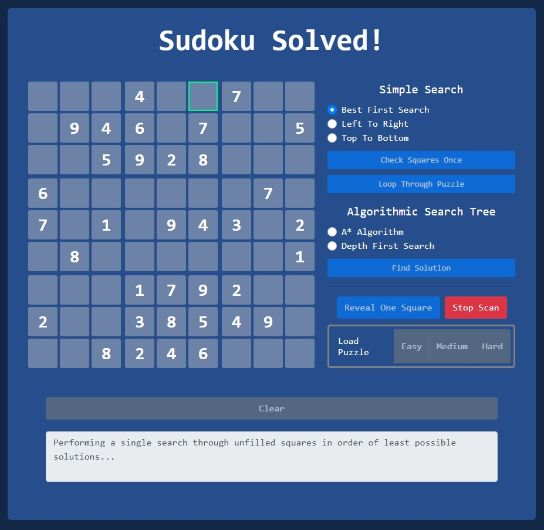

# sudoku-solved

Sudoku Solved is a web application created using Flask and written with Python and Javascript.

This application can currently be found here:
 
<a href="http://samcoogan.pythonanywhere.com/">http://samcoogan.pythonanywhere.com/</a>

